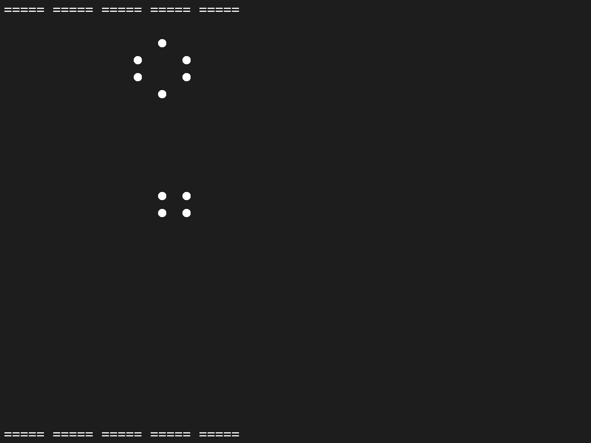

# ecl-mos37-systeme-temps-reel
Travail réalisé pour le MOS 3.7 - Système Temps Réel, Embarqué, et Mobile à l'École Centrale de Lyon. L'objectif est d'aborder la programmation parallèle en C++.

### Exécuter un programme

```sh
g++ -std=gnu++17 <path-to-file> && ./a.out && rm a.out
```

# Valeur approché de PI par calcul du cercle unitaire par Monte-Carlo `./be1/calcul-pi-cercle.cpp`

```sh
# macOS
g++ -std=gnu++17 calcul-pi/calcul-pi.cpp && ./a.out && rm a.out
g++ -std=gnu++17 calcul-pi/calcul-pi-circle.cpp && ./a.out 10000 && rm a.out
```

## Méthode

L'aire du cercle `A = PI * R ^ 2` avec `R` le rayon du cercle.

Pour `R = 1`, `A = PI`.

Nous tirons un grand nombre de point dans le plan `[0, 1] x [0, 1]`. Ce plan correspond à le quart de cercle supérieur droit du cercle.

Pour chaque point `(x, y)`, le point est dans le cercle si et seulement si `x ** 2 + y ** 2 <= 1`.

Soit `n` le nombre de point dans le cercle, `N` le nombre de point tiré. Nous avons une approximation `A / 4 = n / N`.

D'où une approximation de `PI = 4 * n / N`.

## Résultat 

```sh
>> g++ -std=gnu++17 calcul-pi/calcul-pi-circle.cpp && ./a.out 10000 && rm a.out 
3.1496
```

# Méthode de tri (merge sort, quick sort)

```sh
# macOS
g++ -std=gnu++17 merge/merge.cpp && ./a.out && rm a.out
```

## Méthode

On implemente **merge sort** avec une parralélisation symétrique sur l'arbre de découpage du tableau, comme le montre le pseudo-code suivant:

```c++
void mergeSort(int array[], int const begin, int const end)
{
    if (can_create_two_thread)
    {
        new thread down -> mergeSort(bottom half of array)
        new thread up -> mergeSort(up half of array)

        wait_for_threads()
    } else if (can_create_one_tread)
    {
        new thread down -> mergeSort(bottom half of array)
        mergeSort(up half of array)

        wait_for_thread()
    } else
    {
        mergeSort(bottom half of array)
        mergeSort(up half of array)
    }
    merge()
}
```

## Résultat

```sh
>> g++ -std=gnu++17 merge/merge.cpp && ./a.out && rm a.out
Given array is 
7 49 73 58 30 72 44 78 23 9 40 65 92 42 87 3 27 29 40 12 3 69 9 57 60 33 99 78 16 35 
Sorted array is 
3 3 7 9 9 12 16 23 27 29 30 33 35 40 40 42 44 49 57 58 60 65 69 72 73 78 78 87 92 99 % 
```

# Gestionnaire de billes

```sh
# macOS
g++ -std=gnu++17 billes/billes.cpp && ./a.out && rm a.out
```

## Méthode

On a `NB_THREADS` travailleurs qui ont besoin chacun de `needs[i]` billes pour travailler (`i` le numéro du *thread*).

> Exemple: `NB_THREADS = 5` *threads*, `needs = [1, 5, 3, 4, 3]`

On a un nombre limité de billes `NB_BILLES`

Le code simplifié d'un *thread* `t_i`:

```c++
void t(int i) {
    while (true) {
        ask_billes(needs[i]) // waits until it gets billes
        use_billes()
        return_billes()
        wait_time() // sleep (if needed, 1 seconds in the code but can be changed) 
    }
}
```

Un *thread* controlleur vérifie que `0 <= nb_billes <= NB_BILLES`, si la condition n'est pas respecté le programme s'arrête.

## Résultat

```sh
>> g++ -std=gnu++17 billes/billes.cpp && ./a.out && rm a.out
Create 4 workers.
Worker 0 initialised.
Worker 1 initialised.
Worker 2 initialised.
Remaining billes:        (8) ........
Worker 1 received 2 billes
Remaining billes:        (9) .........
Worker 0 received 1 billes
Remaining billes:        (6) ......
Worker 2 received 3 billes
Worker 3 initialised.
Remaining billes:        (3) ...
Worker 0:                (1) .
Worker 1:                (2) ..
Worker 2:                (3) ...
...
Worker 1 returned 2 billes
Remaining billes:        (4) ....
Worker 0:                (1) .
Worker 3:                (4) ....
Worker 3 returned 4 billes
Remaining billes:        (8) ........
Worker 0:                (1) .
Worker 3:                (4) ....
Worker 0 returned 1 billes
Remaining billes:        (9) .........
Worker 2 received 3 billes
Remaining billes:        (6) ......
Worker 2:                (3) ...
Worker 2 returned 3 billes
Work done!
Remaining billes:        (9) .........
```

# Jeu de la vie

```sh
# macOS
g++ -std=gnu++17 game-of-life/game-of-life.cpp && ./a.out && rm a.out
```

## Méthode

Soit `NB_THREAD_SQRT` le nombre de sous-division par ligne et par colonne. On a donc `NB_THREAD = NB_THREAD_SQRT * NB_THREAD_SQRT` le nombre total de division dans la grille.

Chaque division à une taile `GRID_STEP x GRID_STEP`, soit une `GRID_SIZE = GRID_STEP * NB_THREAD_SQRT`.

On définie `grid` une table de `boolean` valant `true` si la `cell` est vivante, `false` sinon. `grid` est étendue au bord *(padding de 1)* pour calculer plus simplement le voisinage de chaque `cell`.

On a deux boucles de `threads`. 
- La première calcule le voisinage en chaque point. Il n'y a pas besoin de `mutex` car aucun case mémoire lu n'est altéré au cours de ce processus.
- La deuxième actualise chaque `cell` en fonction du nombre de voisin.
  - Si `cell` est vivante, elle reste vivante si elle a deux ou trois voisins.
  - Si `cell` est morte, elle devient vivante si elle a exactement trois voisins.

On actualise ensuite l'écran en affichant un cercle si `cell` est vivante, rien sinon.

## Résultat



# Commande utile *(bash)*

Role | Command
-- | --
Move to (x,y) | `\033<x>;<y>f`
Erase screen | `\x1B[2J\x1B[H`

# Utilité du `mutex`

```sh
# macOS
g++ -std=gnu++17 race-condition/race-condition.cpp && ./a.out && rm a.out
```

Pour vérifier qu'il est important de bloquer la mémoire en écriture lors d'un programme à plusieurs processus, on éxécute un code ne le faisant pas et on mesure l'erreur.

## Méthode

```c++
var = 0
for (int i = 0; i < NUM_THREADS; i++)
{
    std::thread([](){
    for(int j = 0; j < NUM_ITERATIONS; j++)
    {
        var++;
    }
    });
}
```

Le programme est siple, on incrémente une variable `NUM_ITERATIONS * NUM_THREADS` fois. On s'attend donc que le résulat soit `NUM_ITERATIONS * NUM_THREADS`. On mesure ensuite la différence au résultat attendu.

## Résultat

```sh
>> g++ -std=gnu++17 race-condition/race-condition.cpp && ./a.out && rm a.out
===== Sans mutex
Nombre de Race Correct: 35 (sur 1000)
Pourcentage de Race Correct: 3.5%
Erreur normalisée (sur 1000 Race): 29.5879%
--- Temps: 140.223ms
===== Avec mutex
Nombre de Race Correct: 1000 (sur 1000)
Pourcentage de Race Correct: 100%
Erreur normalisée (sur 1000 Race): 0%
--- Temps: 1786.88ms
```

On remarque bien que lorsque la variable est incrémenté *au-même moment*, cela pose problème, elle n'est incrémenté qu'une fois au lieu de plusieurs. On force alors l'écriture séquentielle en mémoire, cela nous permet d'obtenir le bon résultat `100%` du temps, mais, comme prévu, ralentis le temps de calcul.